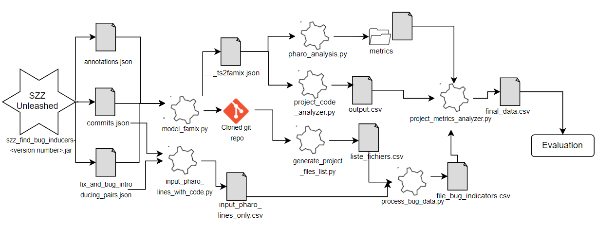

Notre processus d'analyse de code :

## Étape 1 : Extraction des Données
L'analyse commence avec l'outil **SZZ Unleashed** qui extrait des données importantes sous forme de trois fichiers JSON :
- `annotations.json`
- `commits.json`
- `fix_and_bug_introducing_pairs.json`

Ces fichiers contiennent des informations cruciales sur les modifications du code et les corrections apportées aux bugs.

## Étape 2 : Clonage et Modélisation
Le script `model_famix.py` est utilisé pour cloner le dépôt Git et générer un modèle FAMIX sous la forme d'un fichier JSON (`_ts2famix.json`) pour chaque projet analysé. 

## Étape 3 : Analyse Pharo
`pharo_analysis.py` est responsable de l'analyse des modèles FAMIX en exécutant des méthodes spécifiques au langage Pharo. Ce script génère des métriques de code, y compris le nombre de lignes de code (LOC) et la complexité cyclomatique (CC), qui sont ensuite stockées dans le répertoire `metrics`. Les classes Pharo utilisées pour l'analyse ainsi que les tests associés à ces classes se trouvent dans le dossier `pharoProject`.

## Étape 4 : Identification des Lignes Défectueuses
`input_pharo_lines_with_code.py` utilise `commits.json` et `fix_and_bug_introducing_pairs.json` pour marquer les lignes de code défectueuses.

## Étape 5 : Liste des Fichiers de Projet
`generate_project_files_list.py` filtre les fichiers dans le dépôt cloné pour établir une liste exhaustive des fichiers pertinents, en excluant certains types de fichiers (par exemple, JSON, CSV, MD).

## Étape 6 : Fusion des Données et Indicateurs de Bugs
`process_bug_data.py` attribue un indicateur de bogue à chaque fichier, en utilisant 1 pour les fichiers contenant des bugs et 0 autrement.

## Étape 7 : Association des Fichiers aux Classes Correspondantes
Le script `project_code_analyzer.py` est utilisé pour associer chaque fichier à la classe correspondante dans le projet. Cette association permet de mieux comprendre la structure du projet et de faciliter l'analyse des métriques par classe.

## Étape 8 : Analyse des Métriques de Projet
`project_metrics_analyzer.py` prend les métriques, les sorties de script `project_code_analyzer.py` et les indicateurs de bugs pour produire un fichier de données final, qui associe à chaque ligne le LOC, le CC et un indicateur de bogue.

## Évaluation
Pour évaluer l'efficacité de notre analyse, nous utilisons un modèle `RandomForestClassifier`. L'analyse des corrélations entre les métriques se fait avec `project_metrics_correlation_analysis.py`, qui utilise les courbes ROC pour le LOC et le CC. De plus, `generate_graph_srcFile_bugLines.py` est utilisé pour visualiser le nombre de lignes de code défectueuses par projet.